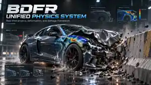

<p align="center">
  
</p>

# BDFR Unified Physics System

**BDFR Unified Physics System** is a modular multi-backend physics framework for Unreal Engine focused on real-time simulation, collision response, deformation, damage, and extensible physics backends.

The project is designed around a unified API so gameplay systems can use **Chaos**, **Bullet Physics**, hybrid simulation, or future custom solvers without being tightly coupled to one physics engine.

## Project Vision

The long-term goal is to provide a scalable physics layer for Unreal Engine that can serve everything from ordinary rigid-body interaction to advanced vehicle crashes, runtime mesh deformation, structural damage, ragdolls, soft bodies, and specialized simulation systems.

### Core goals

- Support **Unreal Chaos** as a native backend.
- Integrate **Bullet Physics** as an alternative runtime backend.
- Support **Hybrid** Chaos + Bullet workflows.
- Keep gameplay-facing APIs backend-agnostic.
- Allow future physics backends to be added without rewriting gameplay code.
- Provide fixed-step and substep simulation foundations.
- Provide backend-neutral impact events for deformation, damage, audio, and gameplay.
- Scale simulation quality across PC, console, and mobile targets.

## Architecture

```text
Unreal Engine
    |
    +-- BDFR Unified Physics System
            |
            +-- Physics Router
            |
            +-- Unified Physics API
            |
            +-- Backends
            |     +-- Chaos
            |     +-- Bullet
            |     +-- Hybrid
            |     +-- Future Custom Backends
            |
            +-- Runtime Systems
                  +-- Rigid Bodies
                  +-- Collision
                  +-- Constraints
                  +-- Vehicles
                  +-- Ragdolls
                  +-- Soft Bodies
                  +-- Live Mesh Deformation
                  +-- Structural Damage / Fracture
```

## Backend Selection

The system is being designed to support backend selection at multiple levels:

```text
Project Default
    -> World Override
        -> Actor / Component Override
```

Current backend types defined by the core:

- `Auto`
- `Chaos`
- `Bullet`
- `Hybrid`
- `None`

`Auto` resolves to the best registered backend available to the runtime. Individual backend modules register factories with the core registry, keeping the core independent from Bullet- or Chaos-specific implementation details.

## Current Implementation

The repository now contains the first functional architecture layer:

- Unreal plugin descriptor
- `BDFRPhysicsCore` runtime module
- `IBDFRPhysicsBackend` common backend interface
- Backend registry and factory system
- Per-world `FBDFRPhysicsRouter`
- `UBDFRPhysicsWorldSubsystem`
- Fixed timestep foundation
- Configurable maximum substeps
- Backend-neutral rigid-body handles and descriptors
- Backend-neutral impact event structure
- Project settings foundation

The core deliberately does **not** include Bullet or Chaos implementation headers. Backend-specific modules will plug into the common interface.

## Live Mesh Deformation

Live deformation is a major planned feature of the framework.

The intended pipeline is:

```text
Bullet / Chaos / Future Backend
              |
        Collision Event
              |
     BDFR Impact Resolver
              |
      Stress / Energy Data
              |
   Live Mesh Deformation
              |
      Collision Update
              |
 Damage / Fracture / Gameplay
```

Planned deformation capabilities include:

- Elastic deformation
- Plastic deformation
- Persistent dents
- Impact-driven deformation
- Explosion-driven deformation
- Material-dependent response
- Localized stress propagation
- Adaptive collision rebuilding
- CPU physical deformation
- GPU visual deformation
- Structural failure and fracture

The deformation layer will consume the common `FBDFRPhysicsImpactEvent` format rather than depending directly on Chaos or Bullet collision callbacks.

## Vehicle Damage Direction

One of the target use cases is physically driven vehicle damage:

```text
Impact
  -> Body-panel deformation
  -> Persistent dents / crushed geometry
  -> Local collision changes
  -> Suspension or wheel damage
  -> Handling changes
  -> Structural failure at extreme loads
```

This allows damage to become part of the simulation instead of remaining purely visual.

## Planned Modules

```text
BDFR_UnifiedPhysicsSystem/
|
+-- Source/
|   +-- BDFRPhysicsCore/
|   +-- BDFRBulletBackend/
|   +-- BDFRChaosBackend/
|   +-- BDFRHybridBackend/
|   +-- BDFRDeformation/
|   +-- BDFRFracture/
|   +-- BDFRPhysicsEditor/
|
+-- ThirdParty/
|   +-- Bullet/
|
+-- Docs/
|   +-- Images/
|
+-- Config/
+-- Content/
+-- Resources/
+-- Examples/
+-- Tests/
```

## Development Roadmap

### Phase 1 — Foundation

- [x] Plugin descriptor
- [x] Core runtime module
- [x] `IBDFRPhysicsBackend` abstraction
- [x] Backend registry
- [x] Physics Router
- [x] World subsystem
- [x] Project settings foundation
- [x] Fixed timestep / substep foundation
- [x] Backend-neutral impact event

### Phase 2 — Bullet Integration

- [ ] Bullet third-party build integration
- [ ] Bullet world management
- [ ] Unit and coordinate conversion layer
- [ ] Rigid bodies
- [ ] Collision shapes
- [ ] Forces and impulses
- [ ] Fixed-step Bullet simulation
- [ ] Debug rendering

### Phase 3 — Constraints & Interaction

- [ ] Fixed constraints
- [ ] Hinge constraints
- [ ] Slider constraints
- [ ] Cone-twist constraints
- [ ] 6DOF constraints
- [ ] Collision/contact events
- [ ] Queries and traces
- [ ] Sleeping / activation controls
- [ ] Continuous collision detection

### Phase 4 — Chaos & Hybrid Routing

- [ ] Chaos backend wrapper
- [ ] Hybrid backend
- [ ] Per-system backend assignment
- [ ] Kinematic proxy bridge
- [ ] Cross-backend event synchronization

### Phase 5 — Deformation & Damage

- [ ] Impact resolver
- [ ] Deformable material model
- [ ] Elastic deformation
- [ ] Plastic deformation
- [ ] Persistent dents
- [ ] Explosion deformation
- [ ] Adaptive collision rebuilding
- [ ] Structural damage
- [ ] Fracture

### Phase 6 — Advanced Simulation

- [ ] Vehicle physics integration
- [ ] Ragdolls
- [ ] Soft bodies
- [ ] CPU/GPU deformation quality tiers
- [ ] Multithreaded simulation
- [ ] Async simulation
- [ ] Deterministic-mode investigation
- [ ] PC / Console / Mobile profiles

## Example Use Cases

- Advanced vehicle crash simulation
- Runtime body-panel deformation
- Impact and explosion damage
- Physics-driven environmental props
- Ragdolls and physical interaction
- Structural failure systems
- Hybrid Chaos/Bullet projects
- Advanced Unreal Engine simulation plugins

## Status

**Early development — core architecture established.**

The next major milestone is the first real **Bullet Physics backend**, including Bullet world creation, rigid-body creation, collision shapes, forces/impulses, stepping, and Unreal/Bullet transform conversion.

## License

License selection is pending.
